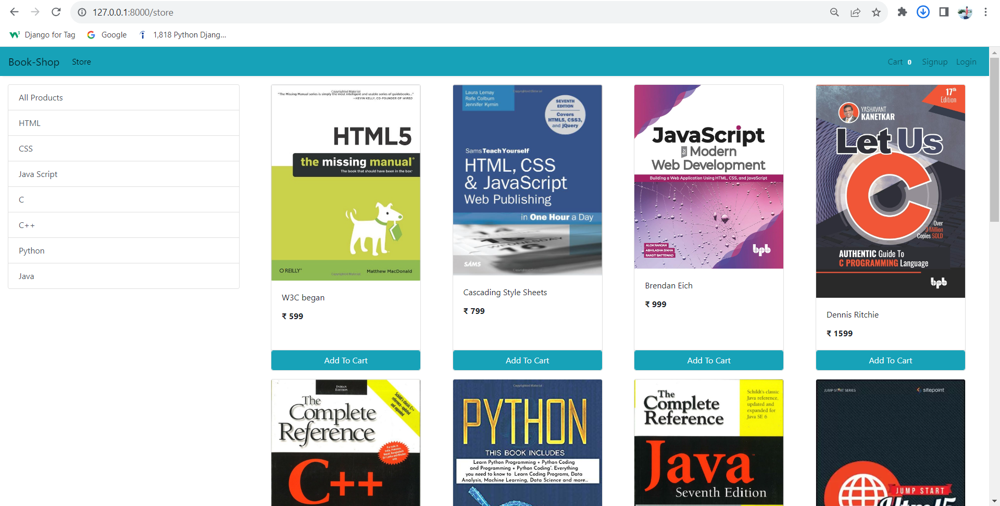

# E-commerce Website using Django
### About the project: Eshop
This project deals with developing a Virtual website ‘Online Book Store Website’. It provides the user with a list of the various Books available for purchase in the store. For the convenience of online shopping, a shopping cart is provided to the user. After the selection of the goods, it is sent for the order confirmation process. The system is implemented using Python’s web framework Django. To develop an e-commerce website, it is necessary to study and understand many technologies.

